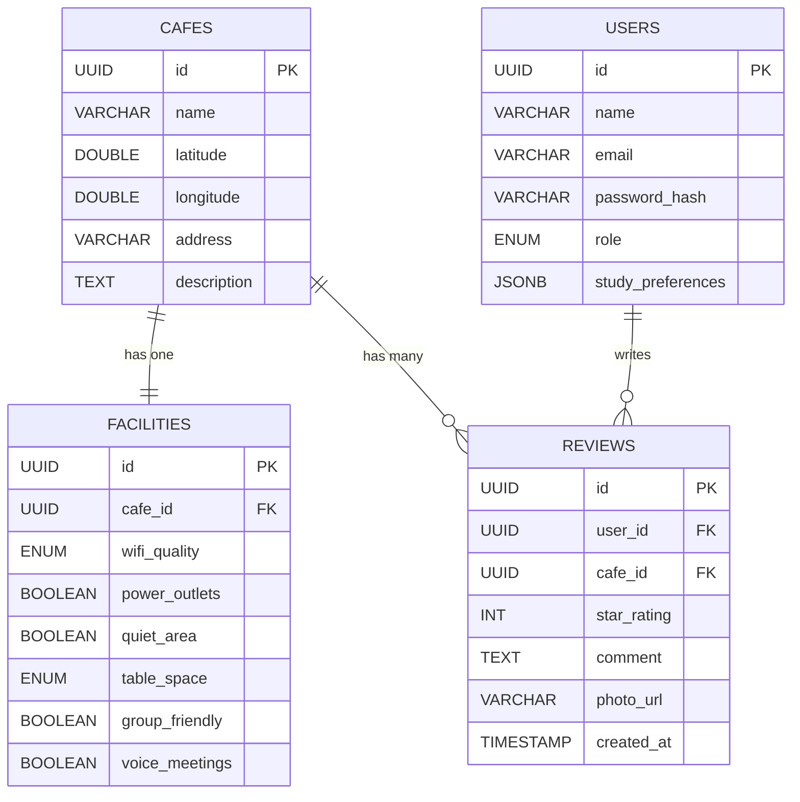

<p align="center">
  
  
  
  
  
</p>

<h1 align="center">📍 WHERE TO STUDY</h1>

<p align="center">
  <strong>A full-stack web application that helps students discover the best cafes and study spots in Riga, Latvia.</strong>
  <br/>
  Filter by Wi-Fi quality, power outlets, quiet zones, and more — all visualized on an interactive map.
</p>

---

## 📸 Screenshots

### 🗺️ Interactive Map Interface (Frontend)
> React + Leaflet map with a glassmorphism sidebar, real-time filtering, and cafe markers.


### 🔌 REST API Response (Backend)
> JSON response from the Spring Boot API endpoint `GET /api/cafes` with full cafe data and facility details.


### 🗄️ PostgreSQL Database — Cafes Table
> The `cafes` table in the `wheretostudy` database showing all registered study spots.


---

## ✨ Features

| Feature | Description |
|---------|-------------|
| 🗺️ **Interactive Map** | Leaflet-based map with custom markers for each cafe location in Riga |
| 🔍 **Smart Filtering** | Filter cafes by Wi-Fi quality, power outlets, and quiet zone availability |
| ⭐ **Reviews & Ratings** | Users can submit star ratings (1-5) and written reviews for each cafe |
| 📋 **Cafe Details Panel** | Slide-out panel showing full cafe info, facilities, and community reviews |
| 🎨 **Glassmorphism UI** | Modern dark-themed interface with blur effects and smooth animations |
| 📡 **RESTful API** | Fully documented API with Swagger/OpenAPI support |
| 🌱 **Auto Seeding** | Database is pre-populated with 5 curated study spots on first launch |

---

## 🏗️ Architecture

```
┌─────────────────────────────────────────────────────────┐
│                      FRONTEND                           │
│              React 19 + Vite + Leaflet                  │
│                  Port: 5173                              │
│                                                         │
│  ┌──────────┐ ┌───────────┐ ┌─────────────────────┐    │
│  │ Sidebar  │ │    Map    │ │  CafeDetailsPanel   │    │
│  │ CafeCard │ │ Component │ │  ReviewList/Form    │    │
│  │FilterPill│ │  Markers  │ │                     │    │
│  └──────────┘ └───────────┘ └─────────────────────┘    │
│                      │ Axios                            │
└──────────────────────┼──────────────────────────────────┘
                       │ HTTP (REST)
┌──────────────────────┼──────────────────────────────────┐
│                   BACKEND                               │
│          Spring Boot 3.4.3 + JPA/Hibernate              │
│                  Port: 8080                              │
│                                                         │
│  ┌────────────┐  ┌──────────┐  ┌──────────────────┐    │
│  │ Controller │→ │ Service  │→ │   Repository     │    │
│  │  (REST)    │  │ (Logic)  │  │  (Spring Data)   │    │
│  └────────────┘  └──────────┘  └──────────────────┘    │
│                                        │                │
└────────────────────────────────────────┼────────────────┘
                                         │ JDBC
┌────────────────────────────────────────┼────────────────┐
│                  DATABASE                               │
│              PostgreSQL 16                              │
│                  Port: 5432                              │
│                                                         │
│     ┌───────┐  ┌────────────┐  ┌─────────┐  ┌───────┐ │
│     │ cafes │  │ facilities │  │ reviews │  │ users │ │
│     └───────┘  └────────────┘  └─────────┘  └───────┘ │
└─────────────────────────────────────────────────────────┘
```

---

## 🗃️ Database Schema



### Enumerations

| Enum | Values |
|------|--------|
| `WifiQuality` | `NONE`, `SLOW`, `FAST`, `VERY_FAST` |
| `TableSpace` | `SMALL`, `MEDIUM`, `LARGE` |
| `Role` | `USER`, `ADMIN` |

---

## 🔗 API Endpoints

### Cafes

| Method | Endpoint | Description | Parameters |
|--------|----------|-------------|------------|
| `GET` | `/api/cafes` | Get all cafes (with optional filters) | `wifiQuality`, `powerOutlets`, `quietArea`, `tableSpace`, `groupFriendly`, `voiceMeetings` |
| `GET` | `/api/cafes/{id}` | Get cafe details by ID | Path: `id` (UUID) |

### Reviews

| Method | Endpoint | Description | Body |
|--------|----------|-------------|------|
| `GET` | `/api/cafes/{cafeId}/reviews` | Get all reviews for a cafe | — |
| `POST` | `/api/reviews` | Create a new review | `userId`, `cafeId`, `starRating`, `comment`, `photoUrl` |

### Example Request

```bash
# Get all cafes with fast Wi-Fi and power outlets
curl http://localhost:8080/api/cafes?wifiQuality=FAST&powerOutlets=true

# Get a specific cafe with full details
curl http://localhost:8080/api/cafes/a5701e6a-79d0-4fb4-ba40-4d041ef92404

# Submit a review
curl -X POST http://localhost:8080/api/reviews \
  -H "Content-Type: application/json" \
  -d '{
    "userId": "user-uuid-here",
    "cafeId": "cafe-uuid-here",
    "starRating": 5,
    "comment": "Amazing place to study!",
    "photoUrl": null
  }'
```

### 📖 Swagger UI

Once the backend is running, interactive API documentation is available at:

```
http://localhost:8080/swagger-ui.html
```

---

## 🚀 Getting Started

### Prerequisites

| Tool | Version | Required |
|------|---------|----------|
| **Java** (JDK) | 21+ | ✅ |
| **Node.js** | 18+ | ✅ |
| **npm** | 9+ | ✅ |
| **PostgreSQL** | 14+ | ✅ |

### 1. Clone the Repository

```bash
git clone https://github.com/YOUR_USERNAME/where-to-study.git
cd where-to-study
```

### 2. Set Up PostgreSQL

Create the database (the tables will be auto-generated by Hibernate on first run):

```sql
CREATE DATABASE wheretostudy;
```

> **Note:** Default credentials are `postgres` / `postgres` on port `5432`. You can change these in `backend/src/main/resources/application.properties`.

### 3. Start the Backend

```bash
cd backend

# Using Maven Wrapper (recommended)
./mvnw spring-boot:run        # Linux/macOS
mvnw.cmd spring-boot:run      # Windows
```

The backend will start on **http://localhost:8080**. On first run, the `DataSeeder` will automatically populate the database with 5 sample cafes, facilities, users, and reviews.

### 4. Start the Frontend

```bash
cd frontend

# Install dependencies
npm install

# Start the development server
npm run dev
```

The frontend will start on **http://localhost:5173**.

---

## 📁 Project Structure

```
where-to-study/
│
├── backend/                          # Spring Boot Backend
│   ├── src/main/java/.../backend/
│   │   ├── config/
│   │   │   ├── DataSeeder.java       # Auto-seeds sample data on startup
│   │   │   ├── OpenApiConfig.java    # Swagger/OpenAPI configuration
│   │   │   └── WebConfig.java        # CORS configuration
│   │   ├── controller/
│   │   │   ├── CafeController.java   # Cafe REST endpoints
│   │   │   └── ReviewController.java # Review REST endpoints
│   │   ├── dto/
│   │   │   ├── CafeDTO.java          # Cafe list response
│   │   │   ├── CafeDetailDTO.java    # Cafe detail response (with reviews)
│   │   │   ├── CreateReviewDTO.java  # Review creation request
│   │   │   ├── FacilityDTO.java      # Facility data transfer
│   │   │   └── ReviewDTO.java        # Review response
│   │   ├── exception/                # Custom exception handlers
│   │   ├── model/
│   │   │   ├── Cafe.java             # Cafe entity
│   │   │   ├── Facility.java         # Facility entity (1:1 with Cafe)
│   │   │   ├── Review.java           # Review entity
│   │   │   ├── User.java             # User entity
│   │   │   └── enums/                # WifiQuality, TableSpace, Role
│   │   ├── repository/               # Spring Data JPA repositories
│   │   └── service/
│   │       ├── CafeService.java      # Business logic for cafes
│   │       └── ReviewService.java    # Business logic for reviews
│   ├── src/main/resources/
│   │   └── application.properties    # Database & server configuration
│   └── pom.xml                       # Maven dependencies
│
├── frontend/                         # React Frontend
│   ├── src/
│   │   ├── components/
│   │   │   ├── CafeCard.jsx          # Cafe list item card
│   │   │   ├── CafeDetailsPanel.jsx  # Detailed cafe view panel
│   │   │   ├── FilterPill.jsx        # Toggle filter buttons
│   │   │   ├── MapComponent.jsx      # Leaflet map with markers
│   │   │   ├── ReviewForm.jsx        # Review submission form
│   │   │   ├── ReviewList.jsx        # Review list display
│   │   │   └── Sidebar.jsx           # Main sidebar with filters & cards
│   │   ├── hooks/                    # Custom React hooks
│   │   ├── pages/
│   │   │   └── Home.jsx              # Main page (map + sidebar)
│   │   ├── services/
│   │   │   ├── api.js                # Axios instance configuration
│   │   │   └── cafeService.js        # API call functions
│   │   ├── App.jsx                   # Root component
│   │   ├── index.css                 # Global styles & design tokens
│   │   └── main.jsx                  # Entry point
│   ├── package.json                  # npm dependencies
│   └── vite.config.js                # Vite configuration
│
└── docs/
    └── screenshots/                  # Application screenshots
```

---

## 🛠️ Tech Stack

### Backend
| Technology | Purpose |
|------------|---------|
| **Spring Boot 3.4.3** | Application framework |
| **Spring Data JPA** | Database access & ORM |
| **Hibernate 6** | JPA implementation |
| **PostgreSQL** | Relational database |
| **Lombok** | Boilerplate code reduction |
| **SpringDoc OpenAPI** | Swagger UI & API docs |
| **Bean Validation** | Request validation |

### Frontend
| Technology | Purpose |
|------------|---------|
| **React 19** | UI library |
| **Vite 7** | Build tool & dev server |
| **React-Leaflet 5** | Interactive map component |
| **Leaflet 1.9** | Map rendering engine |
| **Axios** | HTTP client |
| **Lucide React** | Icon library |

---

## ⚙️ Configuration

All backend configuration lives in `backend/src/main/resources/application.properties`:

```properties
# Server
server.port=8080

# PostgreSQL DataSource
spring.datasource.url=jdbc:postgresql://localhost:5432/wheretostudy
spring.datasource.username=postgres
spring.datasource.password=postgres

# JPA / Hibernate
spring.jpa.hibernate.ddl-auto=update
spring.jpa.show-sql=true

# Swagger / OpenAPI
springdoc.swagger-ui.path=/swagger-ui.html
springdoc.api-docs.path=/api-docs
```

> **Security Note:** In production, never commit database credentials. Use environment variables or a secrets manager instead.

---

## 🤝 Contributing

1. Fork the repository
2. Create your feature branch (`git checkout -b feature/amazing-feature`)
3. Commit your changes (`git commit -m 'Add some amazing feature'`)
4. Push to the branch (`git push origin feature/amazing-feature`)
5. Open a Pull Request

---

## 📄 License

This project is open source and available under the [MIT License](LICENSE).

---

<p align="center">
  Made with ☕ for students who need the perfect study spot.
</p>
