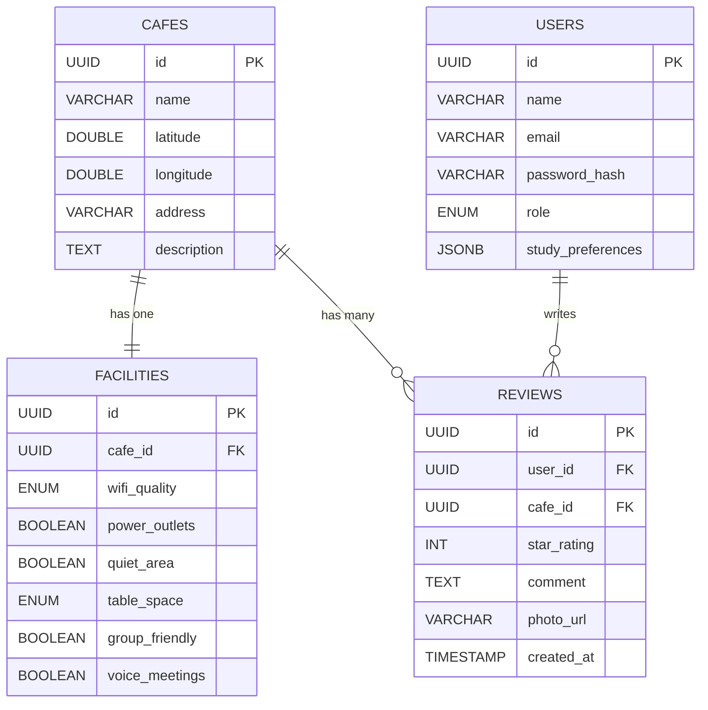

<p align="center">
  
  
  
  
  
</p>

<h1 align="center">📍 WHERE TO STUDY</h1>

<p align="center">
  <strong>A full-stack web application that helps students discover the best cafes and study spots in Riga, Latvia.</strong>
  <br/>
  Filter by Wi-Fi quality, power outlets, quiet zones, and more — all visualized on an interactive map.
  <br/><br/>
  Built by <strong>Behzat Medeni</strong>
</p>

---

## ✨ Features

| Feature | Description |
|---------|-------------|
| 🗺️ **Interactive Map** | Leaflet-based map with custom markers for each cafe location in Riga |
| 🔍 **Smart Filtering** | Filter cafes by Wi-Fi quality, power outlets, and quiet zone availability |
| ⭐ **Reviews & Ratings** | Users can submit star ratings (1–5) and written reviews for each cafe |
| 📋 **Cafe Details Panel** | Slide-out panel showing full cafe info, facilities, and community reviews |
| 🎨 **Glassmorphism UI** | Modern dark-themed interface with blur effects and smooth animations |
| 📡 **RESTful API** | Fully documented API with Swagger/OpenAPI support |
| 🌱 **Auto Seeding** | Database is automatically populated with 5 curated study spots, 2 test users, and 7 sample reviews on every launch |

---

## 🏗️ Architecture

```
┌─────────────────────────────────────────────────────────┐
│                      FRONTEND                           │
│              React 19 + Vite + Leaflet                  │
│                  Port: 5173                             │
│                                                         │
│  ┌──────────┐ ┌───────────┐ ┌─────────────────────┐     │
│  │ Sidebar  │ │    Map    │ │  CafeDetailsPanel   │     │
│  │ CafeCard │ │ Component │ │  ReviewList/Form    │     │
│  │FilterPill│ │  Markers  │ │                     │     │
│  └──────────┘ └───────────┘ └─────────────────────┘     │
│                      │ Axios                            │
└──────────────────────┼──────────────────────────────────┘
                       │ HTTP (REST)
┌──────────────────────┼──────────────────────────────────┐
│                   BACKEND                               │
│          Spring Boot 3.4.3 + JPA/Hibernate              │
│                  Port: 8080                             │
│                                                         │
│  ┌────────────┐  ┌──────────┐  ┌──────────────────┐     │
│  │ Controller │→ │ Service  │→ │   Repository     │     │
│  │  (REST)    │  │ (Logic)  │  │  (Spring Data)   │     │
│  └────────────┘  └──────────┘  └──────────────────┘     │
│                                        │                │
└────────────────────────────────────────┼────────────────┘
                                         │ JDBC
┌────────────────────────────────────────┼────────────────┐
│                  DATABASE                               │
│              PostgreSQL 16                              │
│                  Port: 5432                             │
│                                                         │
│     ┌───────┐  ┌────────────┐  ┌─────────┐  ┌───────┐   │
│     │ cafes │  │ facilities │  │ reviews │  │ users │   │
│     └───────┘  └────────────┘  └─────────┘  └───────┘   │
└─────────────────────────────────────────────────────────┘
```

---

## 🚀 How to Run (Step-by-Step)

> **This guide assumes you are starting from scratch on a clean machine.** Follow every step in order.

### Prerequisites — What You Need Installed

Before running this project, make sure the following software is installed on your computer:

| # | Software | Minimum Version | Download Link | How to Verify |
|---|----------|----------------|---------------|---------------|
| 1 | **Java (JDK)** | 21 or higher | [Oracle JDK](https://www.oracle.com/java/technologies/downloads/) or [OpenJDK](https://adoptium.net/) | Run `java -version` in terminal |
| 2 | **Node.js** | 18 or higher | [nodejs.org](https://nodejs.org/) | Run `node -v` in terminal |
| 3 | **npm** | 9 or higher | Comes with Node.js | Run `npm -v` in terminal |
| 4 | **PostgreSQL** | 14 or higher | [postgresql.org](https://www.postgresql.org/download/) | Run `psql --version` in terminal |
| 5 | **Git** | Any | [git-scm.com](https://git-scm.com/) | Run `git --version` in terminal |

> ⚠️ **IMPORTANT:** Make sure `java`, `node`, `npm`, and `psql` commands are accessible from your terminal (added to your system PATH).

---

### Step 1: Clone the Repository

Open a terminal (Command Prompt, PowerShell, or Git Bash) and run:

```bash
git clone https://github.com/behzatmedeni/software_project.git
cd software_project
```

After cloning, you will see this folder structure:

```
software_project/
├── backend/      ← Java Spring Boot API (port 8080)
├── frontend/     ← React application   (port 5173)
└── docs/         ← Screenshots
```

---

### Step 2: Set Up PostgreSQL Database

You need to create an empty database called `wheretostudy`. The application will automatically create all tables and insert sample data on first run.

#### Option A: Using psql (Command Line)

```bash
# Connect to PostgreSQL as the 'postgres' superuser
psql -U postgres

# Inside the psql prompt, run:
CREATE DATABASE wheretostudy;

# Verify it was created:
\l

# Exit psql:
\q
```

#### Option B: Using pgAdmin (GUI)

1. Open **pgAdmin 4**
2. Connect to your local PostgreSQL server
3. Right-click on **Databases** → **Create** → **Database...**
4. Enter `wheretostudy` as the database name
5. Click **Save**

#### ⚙️ Database Connection Settings

The backend expects the following PostgreSQL connection settings. If your setup is different, update the file `backend/src/main/resources/application.properties`:

```properties
spring.datasource.url=jdbc:postgresql://localhost:5432/wheretostudy
spring.datasource.username=postgres
spring.datasource.password=postgres
```

| Setting | Default Value | Change if... |
|---------|--------------|--------------|
| **Host** | `localhost` | PostgreSQL is on another machine |
| **Port** | `5432` | You installed PostgreSQL on a different port |
| **Database** | `wheretostudy` | You named the database differently |
| **Username** | `postgres` | You use a different PostgreSQL user |
| **Password** | `postgres` | Your PostgreSQL password is different |

> 💡 **Note:** You do NOT need to create any tables manually. Hibernate (`spring.jpa.hibernate.ddl-auto=update`) will automatically create all tables (`cafes`, `facilities`, `users`, `reviews`) when the backend starts. The `DataSeeder` class will then populate them with 5 sample cafes, 2 test users, and 7 reviews.

---

### Step 3: Start the Backend (Spring Boot)

Open a **new terminal window**, navigate to the `backend` folder, and run:

#### On Windows (Command Prompt):

```cmd
cd backend
mvnw.cmd spring-boot:run
```

#### On Windows (PowerShell):

```powershell
cd backend
.\mvnw.cmd spring-boot:run
```

#### On macOS / Linux:

```bash
cd backend
chmod +x mvnw
./mvnw spring-boot:run
```

#### ✅ What Success Looks Like

Wait about 10–20 seconds. You should see output like this in the terminal:

```
  .   ____          _            __ _ _
 /\\ / ___'_ __ _ _(_)_ __  __ _ \ \ \ \
( ( )\___ | '_ | '_| | '_ \/ _` | \ \ \ \
 \\/  ___)| |_)| | | | | || (_| |  ) ) ) )
  '  |____| .__|_| |_|_| |_\__, | / / / /
 =========|_|==============|___/=/_/_/_/

 :: Spring Boot ::                (v3.4.3)

... INFO ... BackendApplication : Started BackendApplication in X.XX seconds
... INFO ... DataSeeder : Database seeded successfully with 5 cafes, 2 users, and 7 reviews.
```

> ⚠️ **Do NOT close this terminal window!** The backend must stay running.

#### 🔍 Verify the Backend is Working

Open your browser and go to:

```
http://localhost:8080/api/cafes
```

You should see a JSON array with 5 cafe objects. If you see this, the backend is running correctly. ✅

You can also open the **Swagger UI** for interactive API testing:

```
http://localhost:8080/swagger-ui.html
```

---

### Step 4: Start the Frontend (React)

Open a **second terminal window** (keep the backend terminal running!), navigate to the `frontend` folder, and run:

```bash
cd frontend
npm install
npm run dev
```

#### ✅ What Success Looks Like

You should see:

```
  VITE v7.3.1  ready in 400 ms

  ➜  Local:   http://localhost:5173/
  ➜  Network: use --host to expose
```

> ⚠️ **Do NOT close this terminal window either!** The frontend must stay running.

---

### Step 5: Open the Application

Open your web browser and navigate to:

```
http://localhost:5173
```

🎉 **You should now see the full application:**
- A **sidebar** on the left with filter pills (Fast Wi-Fi, Power Outlets, Quiet Zone) and a list of 5 cafe cards
- An **interactive map** on the right showing Riga, Latvia with blue markers for each cafe
- Click on any cafe card or marker to see the **details panel** with facilities, reviews, and a review form

---

## 🔑 Quick Start Summary (TL;DR)

For experienced developers, here's the minimal steps:

```bash
# 1. Clone
git clone https://github.com/behzatmedeni/software_project.git
cd software_project

# 2. Create PostgreSQL database
psql -U postgres -c "CREATE DATABASE wheretostudy;"

# 3. Start backend (Terminal 1)
cd backend
./mvnw spring-boot:run          # Linux/macOS
# or: mvnw.cmd spring-boot:run  # Windows

# 4. Start frontend (Terminal 2)
cd frontend
npm install
npm run dev

# 5. Open browser → http://localhost:5173
```

---

## 🗃️ Database Schema



### Enumerations

| Enum | Values | Used In |
|------|--------|---------|
| `WifiQuality` | `NONE`, `SLOW`, `FAST`, `VERY_FAST` | `facilities.wifi_quality` |
| `TableSpace` | `SMALL`, `MEDIUM`, `LARGE` | `facilities.table_space` |
| `Role` | `USER`, `ADMIN` | `users.role` |

### Sample Data (Auto-Seeded)

The `DataSeeder` class automatically populates the database on every application start with:

| Cafe | Address | Wi-Fi | Power | Quiet | Rating |
|------|---------|-------|-------|-------|--------|
| MIIT Coffee | Kipsalas iela 6 | ⚡ Very Fast | ✅ | ✅ | ⭐ 4.5 |
| Rocket Bean Roastery | Miera iela 29/31 | 🔵 Fast | ✅ | ❌ | ⭐ 4.0 |
| Biblioteka No.1 | Terbatas iela 2 | 🔴 Slow | ❌ | ✅ | ⭐ 3.0 |
| Double Coffee RTU | Azenes iela 12 | ⚡ Very Fast | ✅ | ❌ | ⭐ 4.5 |
| Kalve Coffee | Smilsu iela 1 | ⛔ None | ❌ | ✅ | ⭐ 4.0 |

---

## 🔗 API Endpoints

### Cafes

| Method | Endpoint | Description | Query Parameters |
|--------|----------|-------------|------------------|
| `GET` | `/api/cafes` | Get all cafes (with optional filters) | `wifiQuality`, `powerOutlets`, `quietArea`, `tableSpace`, `groupFriendly`, `voiceMeetings` |
| `GET` | `/api/cafes/{id}` | Get full cafe details by UUID | — |

### Reviews

| Method | Endpoint | Description | Request Body |
|--------|----------|-------------|--------------|
| `GET` | `/api/cafes/{cafeId}/reviews` | Get all reviews for a specific cafe | — |
| `POST` | `/api/reviews` | Submit a new review | JSON (see below) |

### Example API Calls

```bash
# 1. Get ALL cafes
curl http://localhost:8080/api/cafes

# 2. Filter: only cafes with FAST Wi-Fi and power outlets
curl "http://localhost:8080/api/cafes?wifiQuality=FAST&powerOutlets=true"

# 3. Get a specific cafe with full details and reviews
curl http://localhost:8080/api/cafes/{cafe-uuid-here}

# 4. Submit a new review
curl -X POST http://localhost:8080/api/reviews \
  -H "Content-Type: application/json" \
  -d '{
    "userId": "user-uuid-here",
    "cafeId": "cafe-uuid-here",
    "starRating": 5,
    "comment": "Amazing place to study!",
    "photoUrl": null
  }'
```

### Swagger UI (Interactive API Documentation)

When the backend is running, visit:

```
http://localhost:8080/swagger-ui.html
```

This provides a fully interactive interface to test all API endpoints directly from the browser.

---

## 📁 Project Structure

```
software_project/
│
├── backend/                              # ☕ Spring Boot Backend
│   ├── src/main/java/.../backend/
│   │   ├── BackendApplication.java       # Application entry point
│   │   ├── config/
│   │   │   ├── DataSeeder.java           # Seeds 5 cafes, 2 users, 7 reviews
│   │   │   ├── OpenApiConfig.java        # Swagger/OpenAPI configuration
│   │   │   └── WebConfig.java            # CORS settings (allows frontend)
│   │   ├── controller/
│   │   │   ├── CafeController.java       # GET /api/cafes, GET /api/cafes/{id}
│   │   │   └── ReviewController.java     # GET reviews, POST new review
│   │   ├── dto/
│   │   │   ├── CafeDTO.java              # Cafe list item response
│   │   │   ├── CafeDetailDTO.java        # Full cafe detail (with reviews)
│   │   │   ├── CreateReviewDTO.java      # Review creation request body
│   │   │   ├── FacilityDTO.java          # Facility info
│   │   │   └── ReviewDTO.java            # Review response
│   │   ├── exception/                    # Custom exception handlers
│   │   ├── model/
│   │   │   ├── Cafe.java                 # Cafe JPA entity
│   │   │   ├── Facility.java             # Facility JPA entity (1:1 with Cafe)
│   │   │   ├── Review.java               # Review JPA entity
│   │   │   ├── User.java                 # User JPA entity
│   │   │   └── enums/                    # WifiQuality, TableSpace, Role
│   │   ├── repository/                   # Spring Data JPA repositories
│   │   │   ├── CafeRepository.java       # Cafe queries + filtering
│   │   │   ├── FacilityRepository.java
│   │   │   ├── ReviewRepository.java
│   │   │   └── UserRepository.java
│   │   └── service/
│   │       ├── CafeService.java          # Cafe business logic & DTO mapping
│   │       └── ReviewService.java        # Review business logic
│   ├── src/main/resources/
│   │   └── application.properties        # Database & server configuration
│   └── pom.xml                           # Maven dependencies
│
├── frontend/                             # ⚛️ React Frontend
│   ├── src/
│   │   ├── components/
│   │   │   ├── CafeCard.jsx              # Individual cafe card in sidebar
│   │   │   ├── CafeDetailsPanel.jsx      # Slide-out detail panel
│   │   │   ├── FilterPill.jsx            # Toggle filter button component
│   │   │   ├── MapComponent.jsx          # Leaflet map with markers
│   │   │   ├── ReviewForm.jsx            # Star rating + comment form
│   │   │   ├── ReviewList.jsx            # Review list display
│   │   │   └── Sidebar.jsx               # Main sidebar (filters + cafe list)
│   │   ├── hooks/                        # Custom React hooks
│   │   ├── pages/
│   │   │   └── Home.jsx                  # Main page (map + sidebar layout)
│   │   ├── services/
│   │   │   ├── api.js                    # Axios base configuration
│   │   │   └── cafeService.js            # API functions (getCafes, etc.)
│   │   ├── App.jsx                       # Root React component
│   │   ├── index.css                     # Global styles & CSS variables
│   │   └── main.jsx                      # Application entry point
│   ├── package.json                      # npm dependencies
│   └── vite.config.js                    # Vite dev server configuration
│
├── docs/screenshots/                     # Application screenshots
└── README.md                             # This file
```

---

## 🛠️ Tech Stack

### Backend

| Technology | Version | Purpose |
|------------|---------|---------|
| **Java** | 21 | Programming language |
| **Spring Boot** | 3.4.3 | Application framework |
| **Spring Data JPA** | — | Database access layer (ORM) |
| **Hibernate** | 6.6.8 | JPA implementation |
| **PostgreSQL** | 16+ | Relational database |
| **Lombok** | — | Reduces boilerplate code |
| **SpringDoc OpenAPI** | 2.8.5 | Swagger UI & API documentation |
| **Bean Validation** | — | Input validation (@Min, @Max, etc.) |
| **Maven** | 3.9+ | Build tool & dependency management |

### Frontend

| Technology | Version | Purpose |
|------------|---------|---------|
| **React** | 19.2 | UI component library |
| **Vite** | 7.3 | Build tool & fast dev server |
| **React-Leaflet** | 5.0 | React wrapper for Leaflet maps |
| **Leaflet** | 1.9 | Interactive map rendering |
| **Axios** | 1.13 | HTTP client for API calls |
| **Lucide React** | 0.577 | Modern icon library |

---

## ⚙️ Configuration Reference

### Backend (`backend/src/main/resources/application.properties`)

```properties
# Server port
server.port=8080

# PostgreSQL connection
spring.datasource.url=jdbc:postgresql://localhost:5432/wheretostudy
spring.datasource.username=postgres
spring.datasource.password=postgres
spring.datasource.driver-class-name=org.postgresql.Driver

# Hibernate auto-creates tables
spring.jpa.hibernate.ddl-auto=update
spring.jpa.show-sql=true
spring.jpa.properties.hibernate.format_sql=true
spring.jpa.properties.hibernate.dialect=org.hibernate.dialect.PostgreSQLDialect

# Swagger UI path
springdoc.swagger-ui.path=/swagger-ui.html
springdoc.api-docs.path=/api-docs
```

### Frontend API Base URL (`frontend/src/services/api.js`)

```javascript
const api = axios.create({
  baseURL: 'http://localhost:8080/api',
});
```

> If the backend runs on a different port, update this file accordingly.

---

## 🐛 Troubleshooting

| Problem | Cause | Solution |
|---------|-------|----------|
| `mvnw.cmd` not recognized | Running from wrong directory | Make sure you are inside the `backend/` folder |
| `JAVA_HOME` not set | Java not in PATH | Install JDK 21+ and add to system PATH |
| `Connection refused` on port 5432 | PostgreSQL not running | Start the PostgreSQL service |
| `database "wheretostudy" does not exist` | Database not created | Run `CREATE DATABASE wheretostudy;` in psql |
| `npm install` fails | Node.js not installed | Install Node.js 18+ from nodejs.org |
| Frontend shows empty map | Backend not running | Start the backend first (Step 3), then refresh |
| CORS error in browser console | Backend not running on port 8080 | Ensure backend started successfully on port 8080 |
| Port 8080 already in use | Another app using port 8080 | Stop the other app, or change `server.port` in `application.properties` |
| `no main manifest attribute` error | Maven wrapper jar issue | Delete `.mvn/wrapper/maven-wrapper.jar` and re-download |

---

## 🤝 Contributing

1. Fork the repository
2. Create your feature branch (`git checkout -b feature/amazing-feature`)
3. Commit your changes (`git commit -m 'Add some amazing feature'`)
4. Push to the branch (`git push origin feature/amazing-feature`)
5. Open a Pull Request

---

## 👤 Author

**Behzat Medeni**
- GitHub: [@behzatmedeni](https://github.com/behzatmedeni)

---

## 📄 License

This project is open source and available under the [MIT License](LICENSE).

---

<p align="center">
  Made with ☕ by <strong>Behzat Medeni</strong> — for students who need the perfect study spot.
</p>
